 

 

# FT SENSOR CALIBRATION

| Rev. | Dep | Prepared  by | Date | Dep                   | Approved | Date         |
| -------- | ---------- | ----|-----|-----|------|---- |
| 0.0  | P&M          | Tome D.                | 15/04/2011 |              |             | 15/04/2011 |
| 1.0  | iCubFacility | Tome D. – Michelini S. | 05/03/2014 | iCubFacility | Randazzo M. | 05/03/2014 |
| 2.0  | iCubFacility | M.Maggiali             | 26-01-2018 |              |             |            |
| 2.1  | iCubFacility | D.Tomé                 | 17/04/19   |              |             |            |
| 2.2  | iCubFacility | D.Tomé                 | 15/07/2019 |              |             |            |
| 2.3  | iCub Tech    | M.Borgagni - D.Tomè    | 11/02/2020 | iCub Tech    | M. Accame   | 11/02/2020 |

##  Revision history

 

 

| Rev. | Date   | Revision  description                   |
| -------- | ---------- | ------------------------------------------------------------ |
| 0.0      | 15/04/2011 | Preliminary   emission                                       |
| 1.0      | 05/03/2014 | Added section 2.1  Matlab replaced by Octave  New report template |
| 2.0      | 26/01/2108 | Added picture of the STRAIN2 and wiring of STRAIN2  and other details. |
| 2.1      | 17/4/19    | E.Barbieri modified wiring diagram (p.11) to fit  with both old and new mechanics |
| 2.2.     | 15/07/2019 | Added image  that shows associations between pcb’s pads and analog channel numbers  (add. 1) |
|2.3	          | 11/02/2020           |New Calibration Procedure                                                            |

## 1. **SW/HW REQUIREMENTS**

### 1.1 Software Requirements

- Create a **icub-tech** folder under C: (just to keep some files)
- ESD CAN SDK (contains CanReal) : \  `\\storage05.icub.iit.local\repository\common\drivers_and_software\esd_can\can_sdk_v620.zip` 
-  GULP (copy both files, install **gulp** and then **wincap**): `\\storage05.icub.iit.local\repository\mechatronics\electronics\Organization\GULP`
- ORACLE VirtualBox(download also **VirtualBox Extension Pack**, install **virtual box** then **ext pack**):  https://www.virtualbox.org/wiki/Downloads  
  
- Tortoise SVN:
https://tortoisesvn.net/downloads.html

- GIT for Windows :
https://git-scm.com/download/win

- Tortoise GIT:
https://tortoisegit.org/download/

- ST-LINK Utility (for flashing updated bootloader and firmware) :
`\\storage05.icub.iit.local\repository\production\TEST STUFF\SoftwareToInstall\ST-LINK Utility`

- ESD CAN-USB Drivers (copy in **icub-tech**, to be used for driver installation of ESD CAN-USB 2066):  
                       `\\storage05.icub.iit.local\repository\production\TEST STUFF\SoftwareToInstall\CAN_CD_V11`
-  Ubuntu 18.04 LTS VM (ready to go with yarp, icub, ftSens repo etc.; copy in **icub-tech**):
`\\storage05.icub.iit.local\repository\production\TEST STUFF\VM\ubuntu 18.04.7z`

- iicub-firmware-build repository (checkout **devel** branch):
https://github.com/robotology/icub-firmware-build.git

- FT Sensor Repository 
https://svn.icub.iit.local/repos/mecha/ftSensCalib/trunk)`

### 1.2 Hardware Requirements
- 1 strain gauge sensor “**GS**” (Figure 1)
- 1 bottom cover for strain gauge     sensor “**BC**”(Figure 1)
- 1 top cover for Strain Gauge     Sensor “**TC**”(Figure 1)
- 1 PCB STRAIN2, (**IITCODE 11996.x)** “**STR**” (Figure 1)
- 3 sets of 6 tinned cables with     these spec : length = 33mm , colors : Blue, Red, Yellow, Green, Black,     White “**CAB1**” (Figure 1)
- 1 cable for connecting the     sensor to power and CAN-USB (**IITCODE 12478.x**)     “**CAB2**”(Figure 1)

                              

Figure 1: Strain gauge sensor, strain pcb, cables and covers

**________________________________________________________________________________________________**

**Serve nuova foto con strain2, meccanica nuova e i fili 3 per colore anziché 2** 

- 1 STRAIN2_ProgramInterface **IITCODE 12348.x** (Figure 2)

  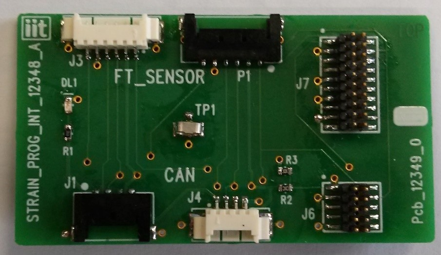    

Figure 2 STRAIN2_ProgramInterface

**________________________________________________________________________________________________**

- 6 6x12x2 mm screws “SC3” (Figure 3)
- 6 6x8x2 mm screws “SC4” (Figure 3)

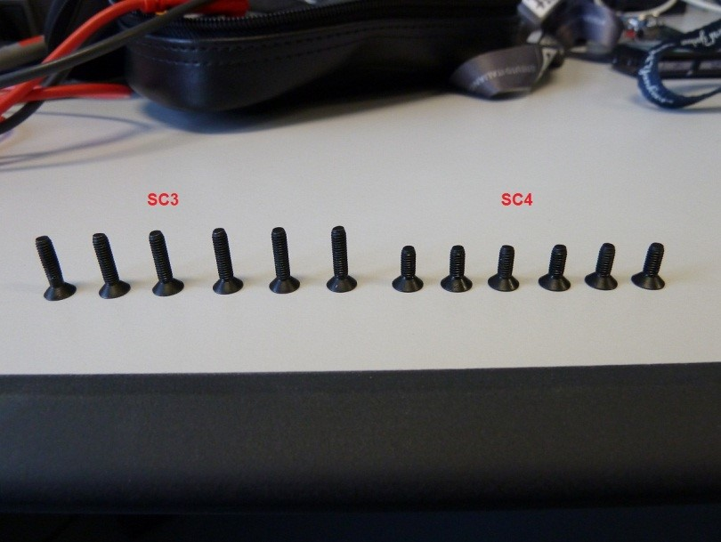   

Figure 3: Screws

**Serve nuovo set di viti e relative foto**

**________________________________________________________________________________________________**

- 1 custom made cross “**CR1**” (Figure 4)
- 1 custom made head “**H1**” (Figure 4)
- 1 custom made head “**H2**” (Figure 4)
- 1 nut FeZn 10MA.2 “**N1**” (Figure 4) 
- 6 3x16x2mm inox countersunk     hexagonal screws “**SC1**” (Figure 4)
- 6 3x18x2.5mm inox hexagonal     screws “**SC2**” (Figure 4)

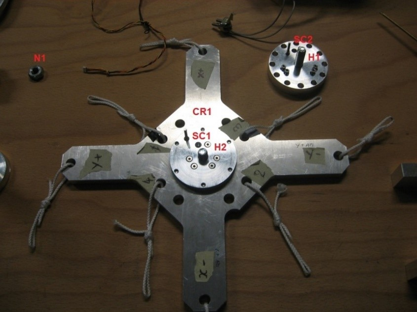   

Figure 4: Custom made cross, heads and the nut

**________________________________________________________________________________________________**

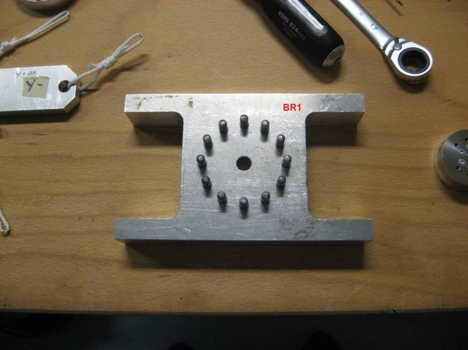

Figure 5: Custom made H bracket
**________________________________________________________________________________________________**

- 1 tightening knob “**K1**” (Figure 6)
- 1 Set of spacers “**S1**” (Figure 6)
- 1 Z axis extension “**EXT1**” (Figure 6)

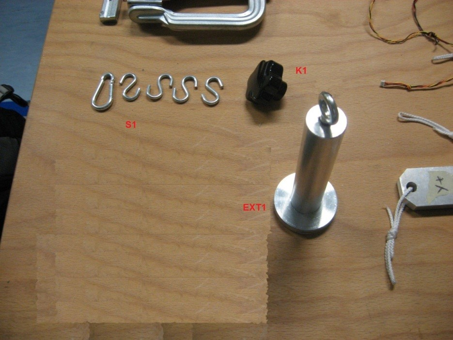 

Figure 6: Custom made spacer, Z axis extension and knob

**________________________________________________________________________________________________**

- 1 Z axis extension “**EXT2**” (Figure 7)

Figure 7: Custom made Z axis extension

**________________________________________________________________________________________________**

- 1 2mm torque screwdriver “**TS1**” (Figure 8)
- 1 2mm hexagonal     screwdriver “**HS1**” (Figure 8)
- 1 2.5mm hexagonal     screwdriver “**HS2**” (Figure 8)
- 1 wrench 17mm “**W1**” (Figure 8)

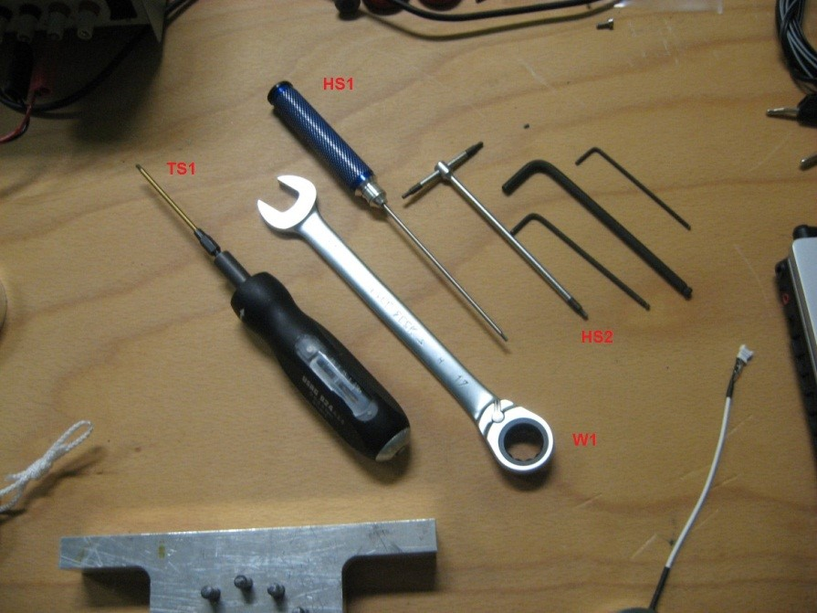

Figure 8: Screwdrivers

**________________________________________________________________________________________________**

- Clamps to fix the structure “**CL1**” (Figure 9)

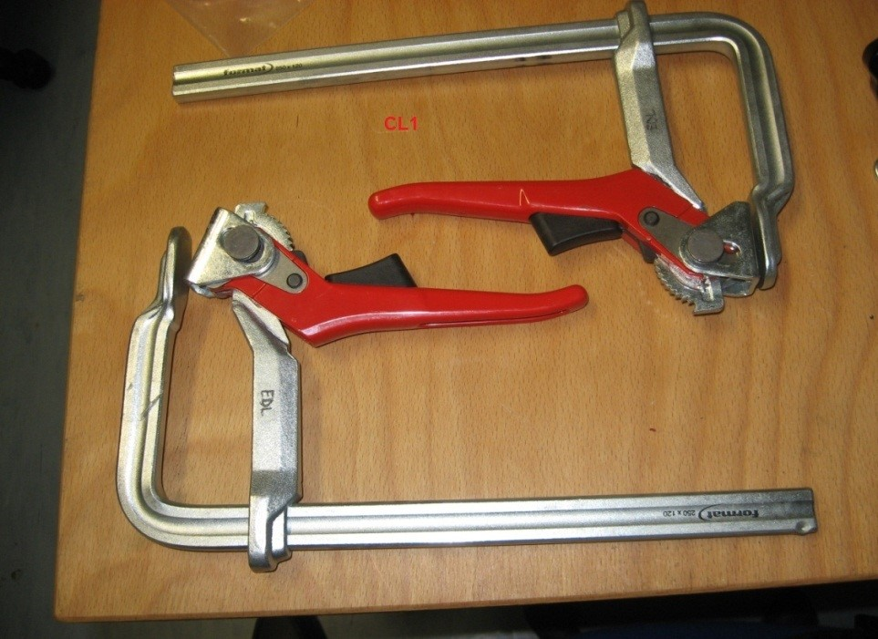

Figure 9: Clamps

**________________________________________________________________________________________________**

- 1 CAN-USB with power and can     bus connection cables 3333.B (Figure 10)

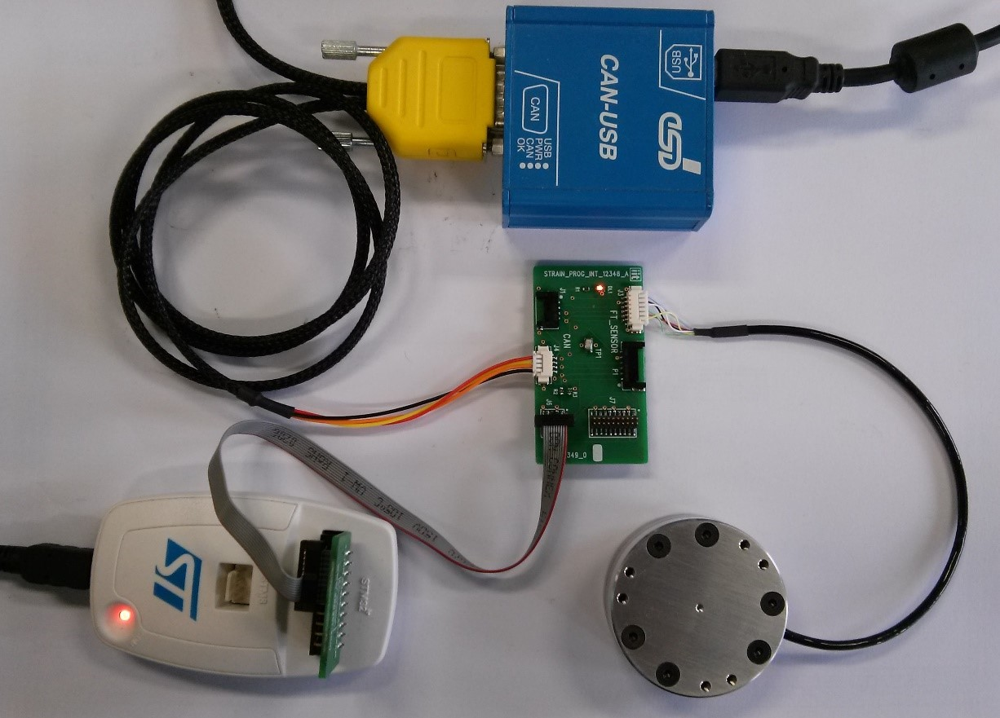

Figure 10: CAN-USB with its cables and connection with the FT-SENSOR

**________________________________________________________________________________________________**

-     1 25Kg load

-     1 5Kg load

## 2   **SENSOR ASSEMBLY**

!!! warning  
    **Handle the sensor taking care not to break thin wires**

### 2.1    Strain Gauge Resistance check

**TEST:** Take the sensor and measure the resistance of each couple of pads for each of three groups as shown below and fill in the respective test report field.

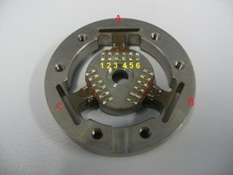

Figure 11: Strain gauge sensor resistance check

 

| Pads  Couple | Resistance  +/- 40% |
| ------------ | ------------------- |
| 1-2          | 430 Ohm             |
| 2-6          | 430 Ohm             |
| 3-5          | 430 Ohm             |
| 4-5          | 430 Ohm             |

Fill in the table in the test reports with values of the resistive strain gauge. 

!!! warning
    Attention! comply with the pairs as shown.

-     Solder the wires CAB1 ( Figure 1 )  to the sensor as shown below

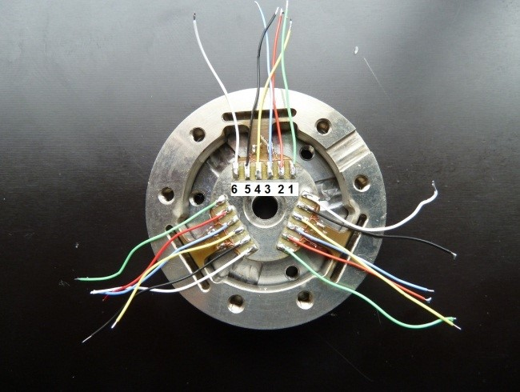  

Figure 12: Sensor  wired

|Pin	|Colour|
| ---- | ------ |
| 1    | GREEN  |
| 2    | RED    |
| 3    | BLUE   |
| 4    | YELLOW |
| 5    | BLACK  |
| 6    | WHITE  |

**________________________________________________________________________________________________**

-    Pass the wires CAB1 (Figure 1) according images below

​    

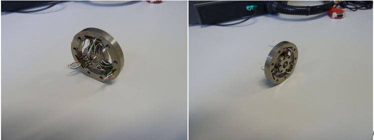

Figure 13: Wire configuration

**________________________________________________________________________________________________**

-    Solder the wires CAB1 (Figure 1) to the Strain PCB as shown below

Figure 14: Sensor wired to the Strain PCB (the sequence of the wires is equal from STRAIN and STRAIN2)

|**Pin** |**Colour**|
| ----- | -------- |
| 1     | BLUE     |
| 2     | RED      |
| 3     | YELLOW   |
| 4     | GREEN    |
| 5     | BLACK    |
| 6     | WHITE    |

**________________________________________________________________________________________________**

-    Solder the wires CAB2 (Figure 1) to the Strain PCB as shown below

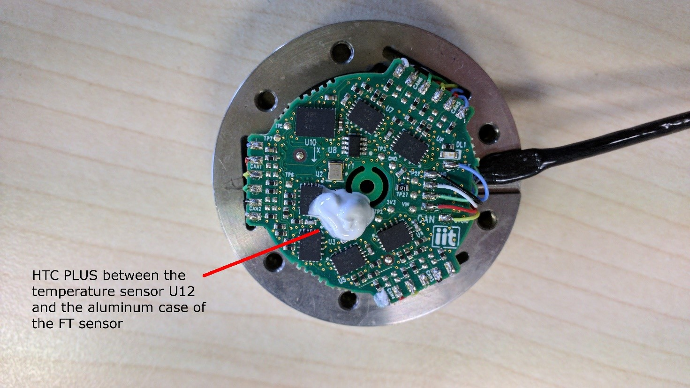

Figure 15A Wiring of the STRAIN2

**________________________________________________________________________________________________**

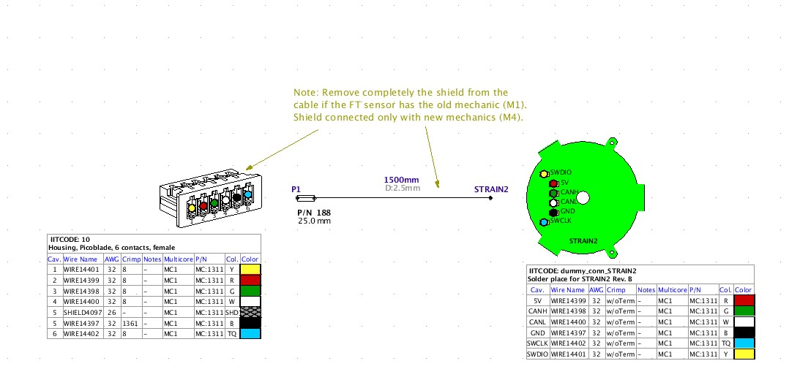

Fig 15B Capital scheme of the strain-2 connections
**________________________________________________________________________________________________**

-     Assembly the sensor with its covers TC and BC (Figure 1) using appropriate screws tightening them using the torque screwdriver TS1 (Figure 8) settled at 2N/m as described in the following **drawing link and extracted notes**

[**Link to new mechanical drawing**](img/ic_008_a_001_new_mec.pdf)

!!! NOTES
    Steps to be taken before assembling and calibrating the FT sensor. Contact technical office for any information about this procedure.

- You need to pre-assemble the FT sensor with the top and bottom covers, central sensor and screws (as shown in Fig.Step1).

- Align the holes for dowel pins before tightening the screws of the bottom and top covers.

- Drill holes of n1.9mm for the dowel pins on &model_name:16 and &model_name:14 and increase them to &d59:1. Test the holes using a Dowel pin of size: ISO 2338B n3.

- Drill holes of n1.9mm for the dowel pins on &model_name:0 and increase them to &d129:1. The pins will be interference fit on this component.
  
- **VERY IMPORTANT**: You have to engrave a" part number" -" serial number" on the three parts which were just assembled with the same denominations used in the production department of IIT before you can disassemble it.
- The part number for this assembly is 12487 , about the S/N ask to IIT Production department. Typically, the format is the following: "00000 - S/N000" where the zeroes stand for a 5-digit and a 3-digit numerical code.
  
- Send the part IC_008_P_001 for gluing on the strain gauge. (Refer to Fig.STEP 2) 

- Assemble the FT sensor (as shown in Fig.STEP 3) and calibrate it according to IIT specifications

  

### 2.2   Short circuit Check

·     Test the wires black red green and white (molex connector) between them and read the resistive values. 

| Color wire connections| Result|
| -------------------------------- | ------------ |
| RED - GREEN                      | Open Circuit |
| RED - WHITE                      | Open Circuit |
| RED - BLACK                      | Open Circuit |
| GREEN - WHITE                    | ± 70KΩ       |
| GREEN - BLACK                    | Open Circuit |
| WHITE - BLACK                    | Open Circuit |
| YELLOW - BLACK                   | Open Circuit |
| TURQUOISE - BLACK                | Open Circuit |
| BLACK - chassy of the sensor     | Open Circuit |
| WHITE - chassy of the sensor     | Open Circuit |
| RED - chassy of the sensor       | Open Circuit |
| GREEN - chassy of the sensor     | Open Circuit |
| YELLOW - chassy of the sensor    | Open Circuit |
| TURQUOISE - chassy of the sensor | Open Circuit |

!!! warning
    If you do not respect the values shown in the table **STOP CALIBRATION AND GIVE BACK TO IIT THE SENSOR FOR INVESTIGATION**
    
## 3	**Pre calibration Check**

-	Connect the F/T sensor , CAN-USB, and ST-LINK2 to the STRAIN_PROGRAM_INT as per [**Fig10**](../img/Fig10-CAN-USB_with-its_cables_and_connection_with_FT_SENSOR.jpg)  (and them to the PC):

-	Browse to “C:\icub-tech\icub-firmware-build\CAN\strain2\st-link” and run “st-link_STRAIN2.bat” (this will flash the bootloader/application)
-	Open the Virtual Machine (user icub, pw icub) and check that the ESD USB-CAN is attached to it (see picture below)

Figure 17
**________________________________________________________________________________________________**

-	Open a terminal in the VM (CTRL+ALT+T) and run “setEsdCan.sh” (enables the ESD USB-CAN linux driver)
**________________________________________________________________________________________________**
-	Open a terminal in the VM (CTRL+ALT+T) and run “FirmwareUpdater -a” (opens the FirmwareUpdtaer GUI) then select “SOCKETCAN<0>” as device and click on Discover button

Figure 18
**________________________________________________________________________________________________**

   **Do the following test**

1.	Select the strain2 (1) and click on Calibrate(2)
2.	in the new window fill SN filed(3) and click on Change (4)
3.	click on Clear and Apply (5, 6); check that the ADC values (7) are close to 0.
4.	Click on Close (8) and confirm saving data to Eeprom. 

Figure 19
**________________________________________________________________________________________________**

-	Power Off the VM (or disconnect the ESD USB-CAN)

**________________________________________________________________________________________________**

-	Open CanReal, Select Send->Load List” and browse to “C:\icub-tech\ftSensCalib\software\sensAquisitionArchive\calib_config_files” then load the “canreal_commands.cspsl” configuration  file  

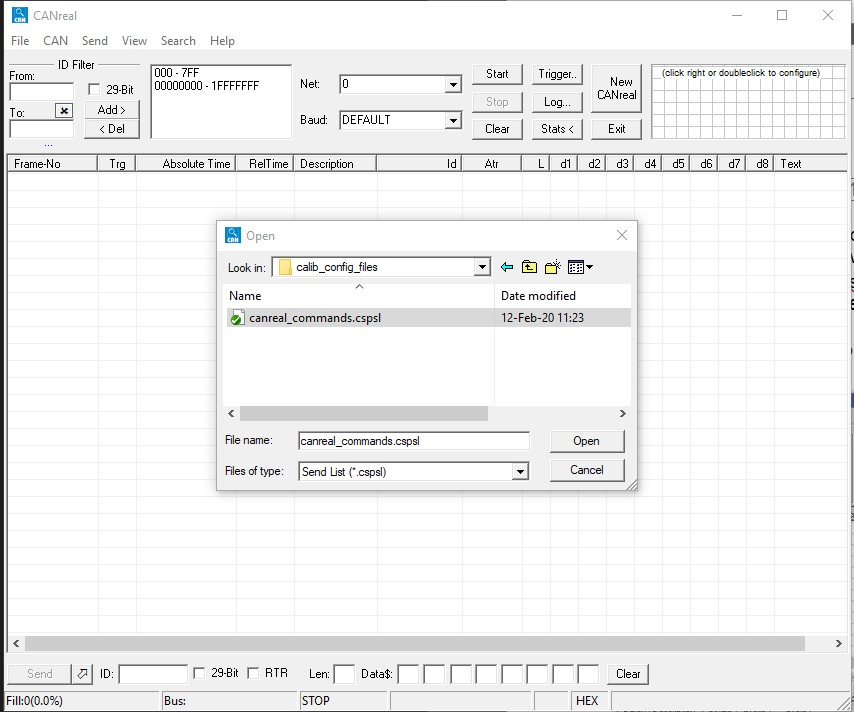
Figure 20
**________________________________________________________________________________________________**

-	Set Baud to 1000 (1), click on Start (2), then send the command (3); you will see the streaming of the sensor readings (4)

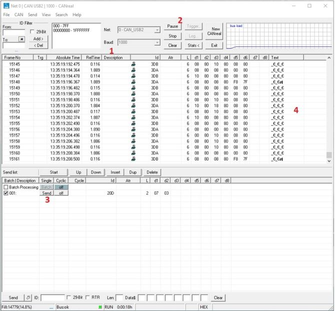

Figure 21

**________________________________________________________________________________________________**

-	Launch Gulp, then select File->Load Parameters, then browse the con file in C:\icub-tech\ftSensCalib\software\sensAquisitionArchive\calib_config_files

**________________________________________________________________________________________________**

-	Select Graph tab, click on “Start” button on the bottom right and you should see 6 colored lines

**________________________________________________________________________________________________**

-	Refer to the picture (Figure 22) place the sensor on the table , press near the three couple of screw holes (A,B,C ) and you should see lines moving DOWN in the gulp window (Figure 23)

!!! warning
    if you do not see lines moving down **DO NOT CONTINUE THE CALIBRATION PROCEDURE.** 

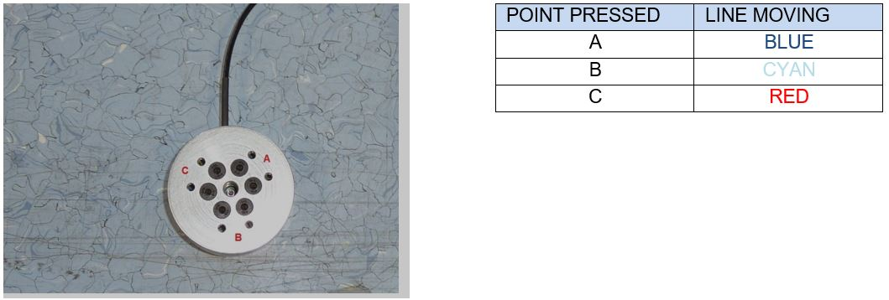

Figure 22:Gulp Pressing  Point-Lines association

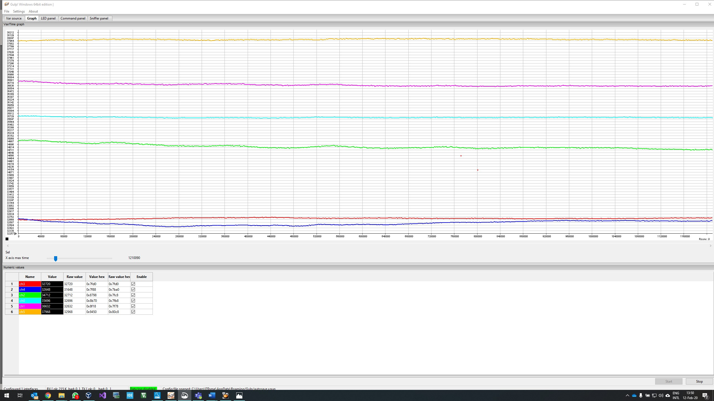

Figure 23
**________________________________________________________________________________________________**

- Refer to the picture (Figure 24) take the sensor in your hands  , and moving your hands as described in  the table you have to see lines moving (figure 25 )

!!! Warning
    if it did not happen **DO NOT CONTINUE THE CALIBRATION PROCEDURE.**

 

Figure 24: Sensor in hands moving directions
**________________________________________________________________________________________________**

**Foto dei segnali ---> da rivedere**

|Right Hand Moving Direction| Left Hand Moving Direction| Orange, Violet and Green GULP lines moving direction|
|----|----|---|
|clockwise|	counterclockwise	|DOWN|
|counterclockwise|	clockwise|	UP|

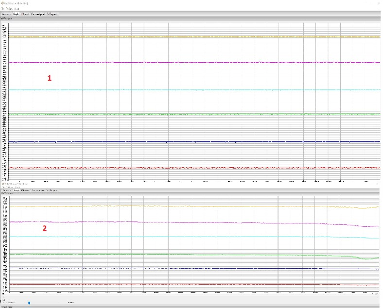

Figure 25
**________________________________________________________________________________________________**
Upper figure(1): start_situation ____ Lower figure(2): after_clockwise operation

-	Click on “Stop” button both in the “Gulp” and “CanReal” applications
-	Close both the applications

## 4   **Sensor Calibration Procedure**

!!! Warning
      **Handle with care the loads and wear accident prevention shoes for your safety!**

- Open the Virtual Machine (user "icub", pw "icub") and check that the ESD USB-CAN is attached to it (see figure 26)

  

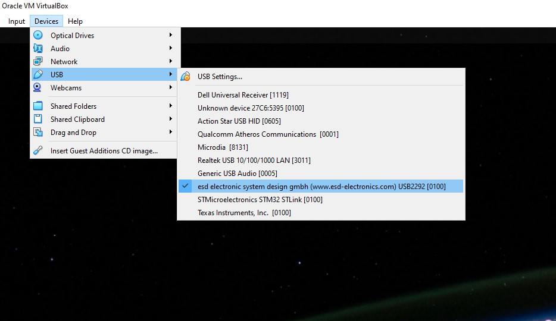

Figure 26

**________________________________________________________________________________________________** 

- Open a terminal in the VM (CTRL+ALT+T) and run “setEsdCan.sh” (it enables the ESD USB-CAN linux driver)

- Check that the folder ***/home/icub/data*** exists

- Open a terminal in the VM (CTRL+ALT+T) and run “FirmwareUpdater -a” (it opens the FirmwareUpdtaer GUI) then select “SOCKETCAN<0>” as device and click on Discover button (see Figure 27)

Figure 27

**________________________________________________________________________________________________**

1)  Select the strain2 and click on Calibrate (see figure 28)

 

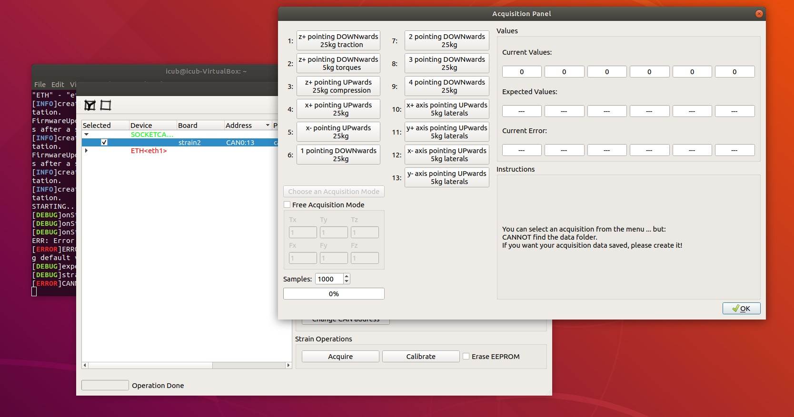

Figure 28

**________________________________________________________________________________________________**

- Follow the steps from 1 to 13 to complete data acquisition (***Each step gives you instructions about the setup configuration - figure 28***)

### 4.1    **Z+ pointing downwards 25kg traction**
- Click on button concerning step 1
- Place the setup with the Z+ axis pointing downwards with EXT2 Z axis extension mounted, without loads and press “Acquire data” button (as shown on figure 28 and figure 29)

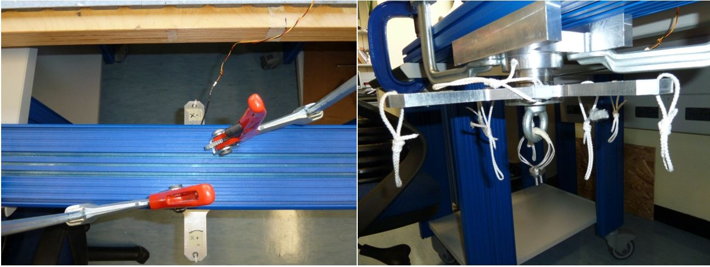 

Figure 29: Setup Configuration
**________________________________________________________________________________________________**

·     Place a 25Kg load on the z+ axis , wait till the load is stable (not swing) and check the numbers in the window. They must be all in green, **if not take note of strange values in the report** (see figure 30)

Figure 30: Load Configuration

**________________________________________________________________________________________________**

- Press “Acquire data” button and remove the load

### 4.2      **Z+ pointing downwards 5kg torques**

- Click on button concerning step 2

- Place the setup with the Z+ axis pointing downwards without EXT2 Z axis extension, without loads and press “Acquire data” button (see figure 31)

Figure 31: Setup Configuration
**_________________________________________________________________________________________________**

- Following the window instructions place a 5Kg load on the “Y-“ axis (and then for the other 3 axes), wait that the load is stable (not swing) and check the numbers in the window. They must be all in green, ***if not take note of strange values in the report***

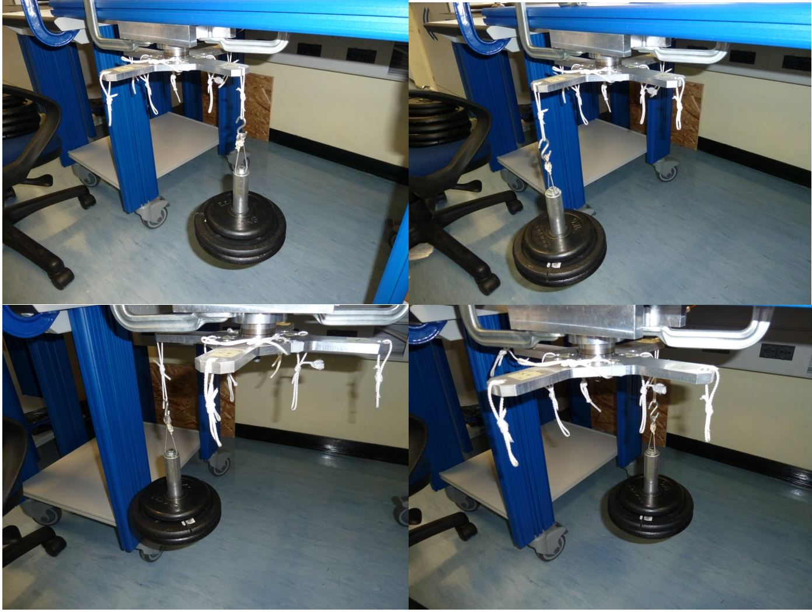

Figure 32: Load Configuration
**________________________________________________________________________________________________**
     
- Press Acquire data button and remove the load

### 4.3    **Z+ pointing upwards 25kg compression**

- Click on button concerning step 3

- Place the setup with the Z+ axis pointing upwards with EXT1 Z axis extension mounted , without loads and press “Acquire data” button (see figure 33)

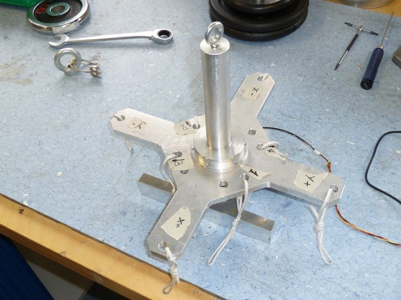

Figure 33: Setup Configuration
**________________________________________________________________________________________________**

- Following the window instructions place a 25Kg load on the “Z+“ axis and check the numbers in the window. They must be all in green, if not take note of strange values in the report

  

Figure 34: Load configuration

- Press “Acquire data” button and remove the load

- Fill in the respective calibration report field

### 4.4    **X+ pointing upwards 25kg**

- Click on button concerning step 4

- Place the setup with the X+ axis pointing upwards without loads and press “Acquire data” button as shown below

Figure 35: Setup Configuration
**________________________________________________________________________________________________** 

- Following the window instructions place a 25Kg load on the “X-“ axis , wait that the load is stable (not swing)  and check the numbers in the window. They must be all in green, **if not take note of strange values in the report**

  

Figure 36: Load configuration

**________________________________________________________________________________________________** 

- Press “Acquire data” button and remove the load

- Fill in the respective calibration report field

### 4.5    **X- pointing upwards 25kg**

- Click on button concerning step 5

- Place the setup with the X- axis pointing upwards without loads and press “Acquire data” button (see figure 37)

Figure 37: Setup Configuration
**________________________________________________________________________________________________**

- Following the window instructions place a 25Kg load on the “X+“ axis , wait that the load is stable (not swing) and check the numbers in the window. They must be all in green, **if not take note of strange values in the report**

Figure 38: Load configuration
**________________________________________________________________________________________________**

- Press “Acquire data” button and remove the load

- Fill in the respective calibration report field

### 4.6    **“1” pointing downwards 25kg**

- Click on button concerning step 6

- Place the setup with the label “1” pointing downwards without loads and press “Acquire data” button (see figure 39)

  

Figure 39: Setup Configuration
**________________________________________________________________________________________________**
- Following the window instructions place a 25Kg load on the “1“ label , wait that the load is stable (not swing) and check the numbers in the window. They must be all in green, **if not take note of strange values in the report**

  

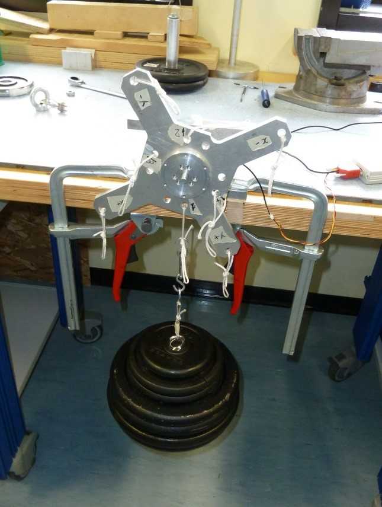

Figure 40: Load configuration
**________________________________________________________________________________________________**

- Press “Acquire data” button and remove the load

- Fill in the respective calibration report field

### 4.7    **“2” pointing downwards 25kg**

- Click on button concerning step 7

- Place the setup with the label “2” pointing downwards without loads and press “Acquire data” button (see figure 41)

  

Figure 41: Setup Configuration
**________________________________________________________________________________________________**

- Following the window instructions place a 25Kg load on the “2“ label, wait that the load is stable (not swing) and check the numbers in the window. They must be all in green, **if not take note of strange values in the report**

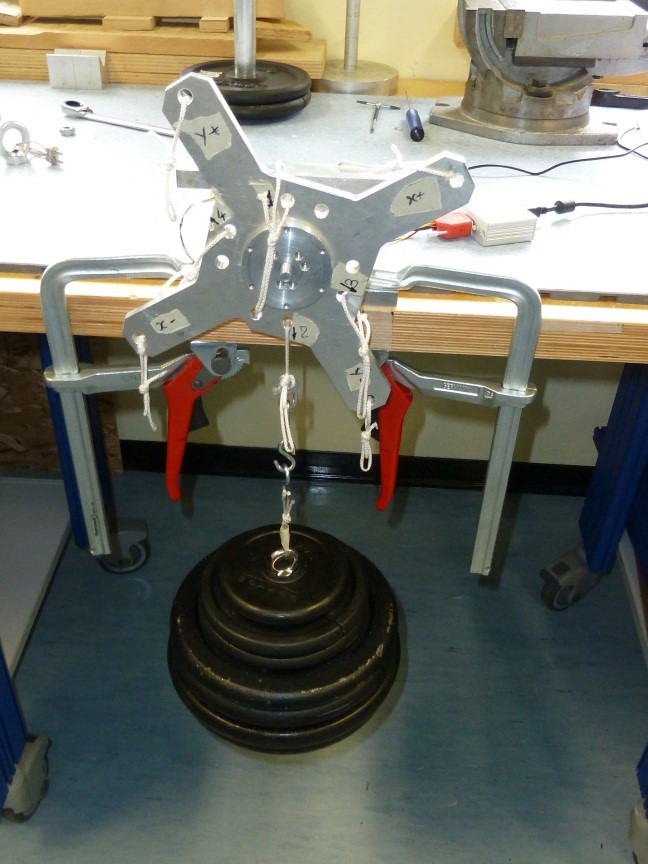

Figure 42: Load configuration
**________________________________________________________________________________________________**

- Press “Acquire data” button and remove the load
- Fill in the respective calibration report field

 

### 4.8    **“3” pointing downwards 25kg**

- Click on button concerning step 8

- Place the setup with the label “3” pointing downwards without loads and press “Acquire data” button (see fig 43)

Figure 43: Setup Configuration
**________________________________________________________________________________________________**
- Following the window instructions place a 25Kg load on the “3“ label ,wait that the load is stable (not swing) and check the numbers in the window. They must be all in green, **if not take note of strange values in the report**
  

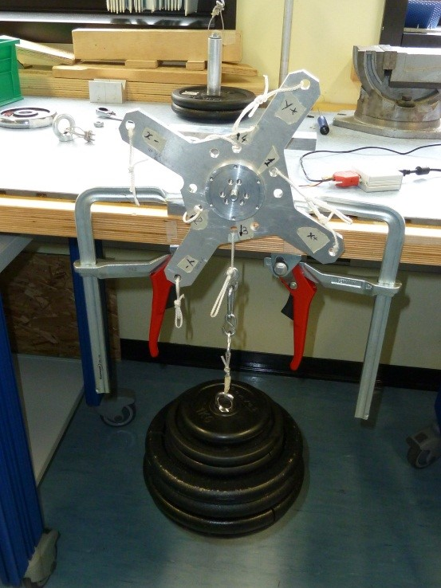

Figure 44: Load configuration
**________________________________________________________________________________________________**

- Press “Acquire data” button and remove the load
- Fill in the respective calibration report field

### 4.9    “4” pointing downwards 25kg

- Click on button concerning step 9

- Place the setup with the label “4” pointing downwards without loads and press “Acquire data” button (see figure 45)

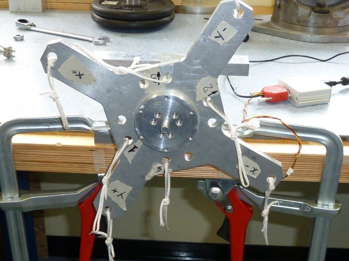

Figure 45: Setup Configuration
**________________________________________________________________________________________________**
- Following the window instructions place a 25Kg load on the “4“ label, wait that the load is stable (not swing) and check the numbers in the window. They must be all in green, **if not take note of strange values in the report**

  

Figure 46: Load configuration
**________________________________________________________________________________________________**

- Press “Acquire data” button and remove the load
- Fill in the respective calibration report field

### 4.10   X+ pointing upwards 5kg laterals

- Click on button concerning step 10
- Place the setup with the axis  “X+” pointing upwards with the EXT1 Z axis extension mounted, without loads and press “Acquire data” button (see figure 44)

Figure 47: Setup Configuration
**________________________________________________________________________________________________**

- Following the window instructions place a 5Kg load on the Y- axis (then on the Z+ and Y+ axes), wait that the load is stable (not swing) and check the numbers in the window. They must be all in green, **if not take note of strange values in the report**

Figure 48: Load configurations (3x)

**________________________________________________________________________________________________** 

- Press “Acquire data” button and remove the load
- Fill in the respective calibration report field 

### 4.11   **Y+ pointing upwards 5kg laterals**

- Click on button concerning step 11
- Place the setup with the axis  “Y+” pointing upwards with the EXT1 Z axis extension mounted, without loads and press “Acquire data” button (see figure 49)

Figure 49: Setup Configuration
**________________________________________________________________________________________________** 

- Following the window instructions place a 5Kg load on the X+ axis (then on the Z+ and X- axes), wait that the load is stable (not swing) and check the numbers in the window. They must be all in green, **if not take note of strange values in the report**

Figure 50: Load configurations (3x)

- Press “Acquire data” button and remove the load
- Fill in the respective calibration report field

### 4.12   **X- pointing upwards 5kg laterals**

- Click on button concerning step 12
- Place the setup with the axis  “X-” pointing upwards with the EXT1 Z axis extension mounted, without loads and press “Acquire data” button (see figure 51)

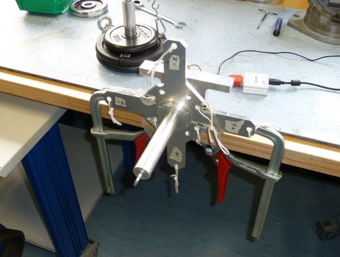

  

Figure 51: Setup Configuration
**________________________________________________________________________________________________** 

- Following the window instructions place a 5Kg load on the Y+ axis (then on the Z+ and Y- axes), wait that the load is stable (not swing) and check the numbers in the window. They must be all in green, **if not take note of strange values in the report**

Figure 52: Load configurations (3x)
**________________________________________________________________________________________________**

- Press “Acquire data” button and remove the load
- Fill in the respective calibration report field

### 4.13   **Y- pointing upwards 5kg laterals**

- Click on button concerning step 13
- Place the setup with the axis  “Y-” pointing upwards with the EXT1 Z axis extension mounted, without loads and press “Acquire data” button (see figure 53)

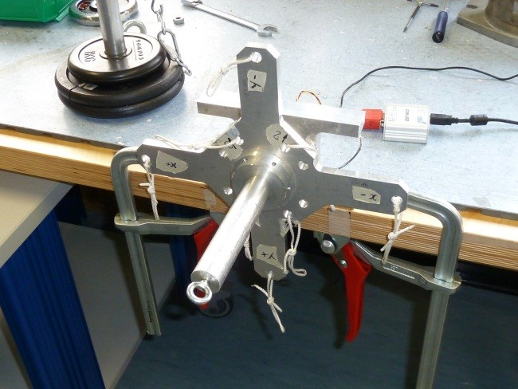
Figure 53: Setup Configuration
**________________________________________________________________________________________________**

- Following the window instructions place a 5Kg load on the X- axis (then on the Z+ and X+ axes), wait that the load is stable (not swing)  and check the numbers in the window. They must be all in green, **if not take note of strange values in the report**

Figure 54: Load configurations
**________________________________________________________________________________________________**

- Press “Acquire data” button and remove the load
- Fill in the respective calibration report field

## 5   **Generating Calibration Matrix**
- Close the FirmwareUpdater application.
- Disassemble the calibration setup from the sensor and keep it connected to the PC
- On the VM create a directory named 

***/home/icub/ftSensCalib/trunk/software/sensAquisitionArchive/cod_iit_XXX/SNXXX***

Where ” ***cod_iit_XXX***” and ***SNXXX*** are the IIT code folder name and  the serial number of the sensor under test.

- Copy all files just generated :

From : ***/home/icub/data***

To   : ***/home/icub/ftSensCalib/trunk/software/sensAquisitionArchive/cod_iit_XXX/SNXXX***

- Type ***cd/home/icub/ftSensCalib/trunk/software/sensAquisitionArchive/matlabFiles***

- Type ***gedit main.m***
- Change the sensFolder = cod_iit_xxxx and “sensNum = 'SNxxx';   % sensor to calibrate” statement with your sensor code and serial number and click Save and close (See figure 55)

Figure 55

**________________________________________________________________________________________________**

- Type ***octave main.m***
- Check if the matrix_SNxxx.txt is present in the sensor folder
- Open a terminal in the VM (CTRL+ALT+T) and run ***FirmwareUpdater -a*** (open the FirmwareUpdtaer GUI) then select ***SOCKETCAN<0>*** as device and click on Discover button (see figure 56)

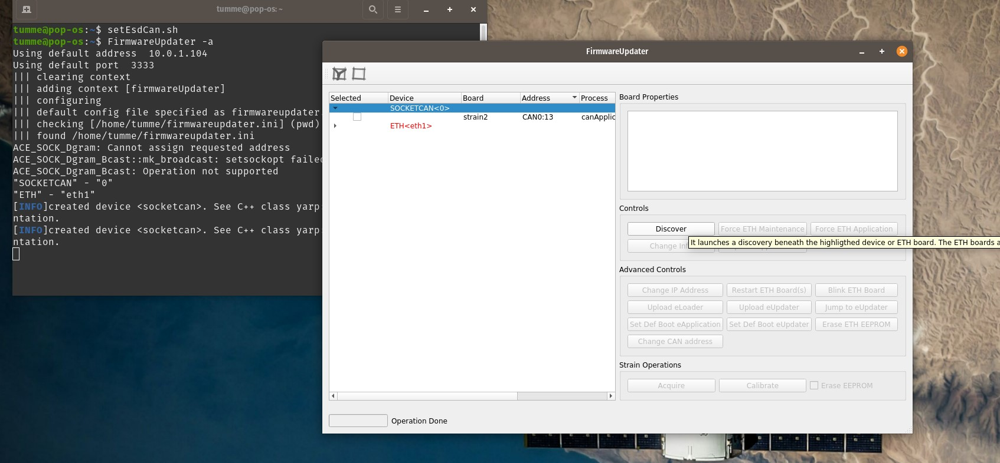
Figure 56
**________________________________________________________________________________________________**

- Select the strain2 and click on Calibrate
- Click on Import in Matrix and full scales section and select the matrix_SNXX.txt file just generated
- Click on Send, Tune and check Apply digital regulation

Figure 57
**________________________________________________________________________________________________**

- Select EEPROM->Save to EEPROM in the top bar
- Select Save Calibration File and select the sensor folder ***(/home/icub/ftSensCalib/trunk/software/sensAquisitionArchive/cod_iit_XXX/SNXXX)***
- Check that the measurement of Fz on the z axis is nearby 0
- Apply 1kg on the top of the sensor and check that the measurement of Fz on the z axis is nearby 10 or -10 (it depends on which side of the senor the load is placed) - see figure 58

Figure 58
**________________________________________________________________________________________________** 

## 6   **Committing files**
In a terminal :

- **cd** **/home/icub/ftSensCalib/trunk/software/sensAquisitionArchive/cod_iit_XXX**

- Do **“svn add SNXXX”**
- type **“svn commit”**; the window shown below will open, type “CTRL+X”(see figure 59)

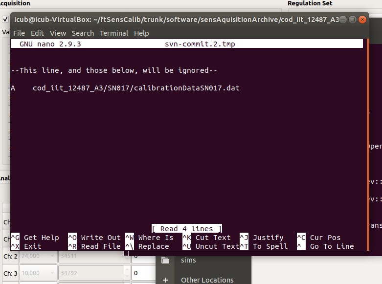

Figure 59
**________________________________________________________________________________________________** 

- At the choice below answer “c” and insert IIT short username and pw if asked for

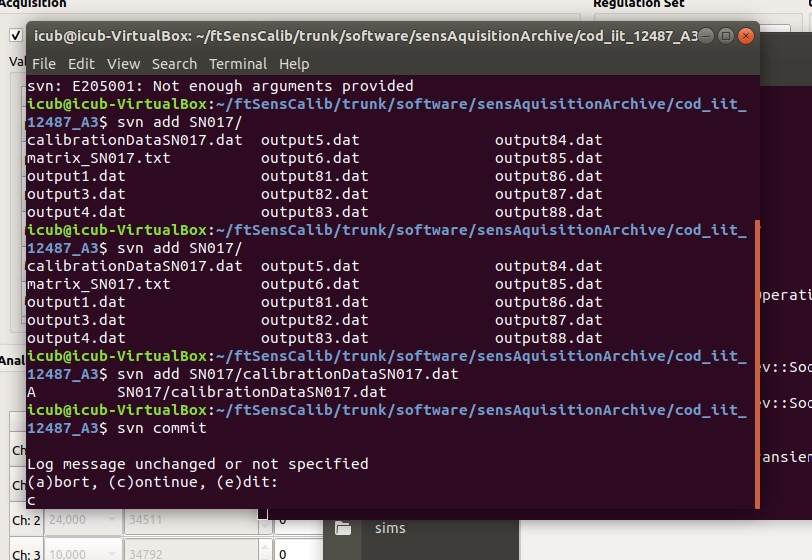

Figure 60
**________________________________________________________________________________________________**

- Now you can close Ubuntu VM and do SVN update on windows

## 7   **Sensor Calibration Report**

| |  |
| ---------------------- | ----------- |
| **SENSOR  S/N:**       |             |
| **Test Date:**         | **Tester:** |
| **Strain Gauge  S/N:** |             |

 

| **Test**                                                 | **Passed** | **Failed** |
| -------------------------------------------------------- | ---------- | ---------- |
| 2.1 **Strain Gauge Resistance check**                    |            |            |
| 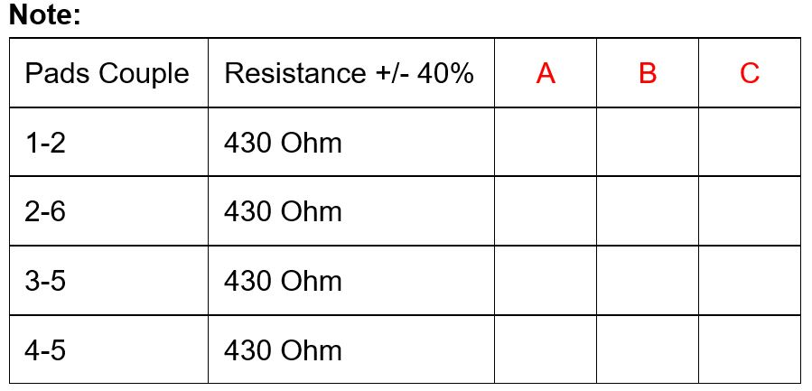 |            |            |
| 2.2 **Short circuit Check**                              |            |            |
| **Note:**                                                |            |            |
| 4.1 **Z+ pointing  downwards 25kg traction**             |            |            |
| **Note:**                                                |            |            |
| 4.2 **Z+ pointing  downwards 5kg torques**               |            |            |
| **Note:**                                                |            |            |
| 4.3 **Z+ pointing  upwards 25kg compression**            |            |            |
| **Note:**                                                |            |            |
| 4.4 **X+ pointing upwards 25kg**                         |            |            |
| **Note:**                                                |            |            |
| 4.5 **X- pointing upwards 25kg**                         |            |            |
| **Note:**                                                |            |            |
| 4.6 **“1” pointing downwards 25kg**                      |            |            |
| **Note:**                                                |            |            |
| 4.7 **“2” pointing downwards 25kg**                      |            |            |
| **Note:**                                                |            |            |
| 4.8 **“3” pointing downwards 25kg**                      |            |            |
| **Note:**                                                |            |            |
| 4.9 **“4” pointing downwards 25kg**                      |            |            |
| **Note:**                                                |            |            |
| 4.10 **X+ pointing  upwards 5kg laterals**               |            |            |
| **Note:**                                                |            |            |
| 4.11 **Y+ pointing  upwards 5kg laterals**               |            |            |
| **Note:**                                                |            |            |
| 4.12 **X- pointing  upwards 5kg laterals**               |            |            |
| **Note:**                                                |            |            |
| 4.13 **Y- pointing  upwards 5kg laterals**               |            |            |
| **Note:**                                                |            |            |

## 8   **ADDENDUM: STRAIN2 PCB PADS-CHANNEL RELATIONSHIP**

#  

 
