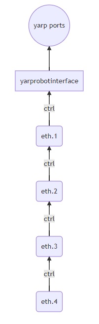
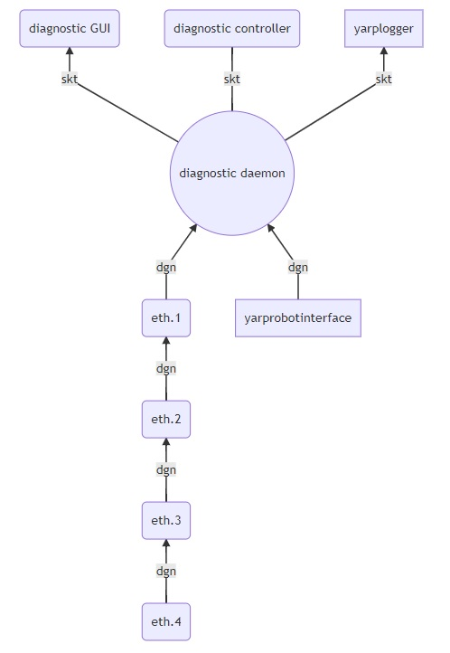
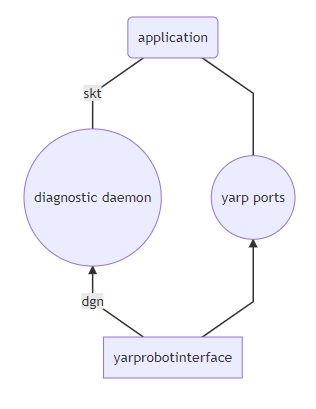

# diagnostica embedded

## scopo

realizzare un'architettura di diagnostica piú snella e flessibile che possa anche scambiare infromazioni con le applicazioni di alto livello.

## flusso dati di controllo

questo è il flusso dei dati di controllo che dalle schede ETH viaggiano verso yarprobotinterface su canale dedicato ed ottimizzato per il real time e che poi vengono pubblicate sulle `yarp ports`.

## flusso dati di diagnostica 

I messaggi di diagnostica viaggiano invece dalle schede ETH verso il `diagnostic daemon` su un canale differente. Anche `yarprobotinterface` pubblica messaggi di diagnostica verso il `diagnostic daemon`. 

Il `diagnostic daemon` pubblica verso il `yarplogger`  e/o altra `GUI` ed anche verso altre destinazioni nei modi specificat dal `diagnostic controller`.  

## interazioni con le applicazioni

Le `app`di alto livello sfruttano le informazioni pubblicate da `yarprobotinterface` sulle `yarp ports` ed interrogano il `diagnostic daemon` per scoprire eventuali malfunzionamenti.

