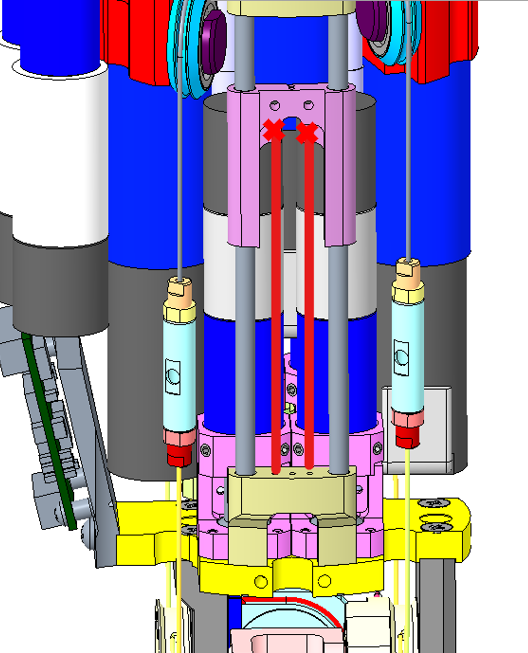
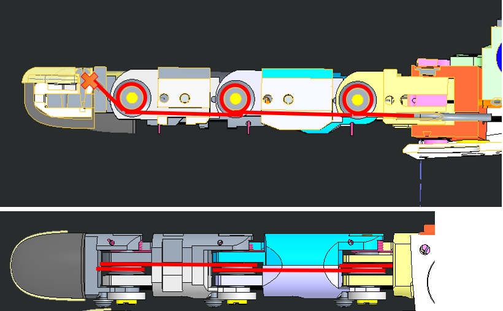

# HOWTO REPAIR ANY CABLE FROM A FOREARM or HAND - VERSION 2

## LOWER ARM VERSION 2

> let's have an overview of the mechanical CAD from different view angles.

| Left Forearm V2                                           | Right Forearm V2                                          |
| --------------------------------------------------------- | --------------------------------------------------------- |
|  |  |

### <u>Rules of Thumb for a good start:</u>

> 1 - Visual inspection (remove the covers - around the forearm and above the hand - and look for broken cables)
>
> 2 - Identification (which part needs to be repaired)
>
> 3 - Cleaning and Removing the broken cable

!!!TIP
    First once you identify the motor/joint to recable - You need to remove the bar to work more easily. Just remove the 4 lateral screws.

### Do I need to disconnect the Lower Arm?

The answer is :

| what is broken?                                              | REMOVING OR NOT   |
| ------------------------------------------------------------ | ----------------- |
| **distal joint** (Thumb, Index, Midldle, Ring or Pinkie)     | **NOT** necessary |
| **every other joint** (all proximals, fingers abduction and Thumb oppose ) | **MANDATORY**     |

## Distal Joints

There are 2 types of distal Joint on this version of the forearm:

* The simplest ones which go inside a motor shaft to get anchored, and as soon as the motor is spinning the cable rolls around the pulley and close the joint. Those motors are <u>*perfectly*</u> identical - only the positions differ :

  > Thumb, Index & Middle distals

* The 2 trickiest ones which are actually a double distal joint in one motor.

  > Ring and Pinkie Fingers

### Where are those cables located?

Here is the table to locate all the distal joints on a forearm (**left** in this case)

| LOCATION | JOINT  | POSITION |
| ---- | ----- | --|
|  | Index and Middle | they are located **ATOP** the forearm when it <u>lies</u> palm face **DOWN** |
|  | Thumb distal **AND** Ring and Pinkie | They are located **ATOP** when the forearm <u>lies</u> palm face **UP** |

!!! danger "WATCH OUT"
    FOR the **Right forearm** : the motor positions are "mirrored" respect to the **left** ones.

| RIGHT FOREARM                                                | LEFT FOREARM                                                 |
| ------------------------------------------------------------ | ------------------------------------------------------------ |
|  |  |

### Let's start wiring!!!

#### 	1. Preparation

The minimum requirement to start recabling distal joints is:

| IITCODE | Alias    | Description                                                  |
| ------- | -------- | ------------------------------------------------------------ |
| 2391    | U7194561 | Stainless steel microcable, cable construction 7x19mm, nom. dia 0.45mm, outer dia 0.61mm, Polyamide coated, AISI 316 - CARL STAHL GMBH |

#### 	2. HOWTO create a knot

|                                                         | STEP BY STEP GUIDE FOR A GOOD KNOT                           |
| ------------------------------------------------------- | ------------------------------------------------------------ |
|         | Start by cutting one piece of 40cm from the cable IITCODE 2391. Make a knot at one extremity. |
|  | use 2 pliers to close it hard. The plier closest to the knot is just opened-free to let the cable to run over it but is here to block the knot, the second one pull the cable to tighten the knot. |
|        | drop a tear of glue on the knot and dry it.  **REMOVE** the excess with a tissue - double check that the knot is perfectly dry before to procede. |
|        | cut the excess of cable                                      |
|        | FINISHED!!!|

#### 	3. Wiring Explanation

#### <u>THUMB</u>

> we will proceed by showing you how to recable the distal thumb on the **LEFT**  Forearm - Just be aware that the motors for the **RIGHT** Forearm are **mirrored** as per the WATCH OUT above explained.

| pictures | step by step guide |
| --- | --- |
|   | 1. Insert the knot until it remains inside the socket of the pulley |
|  | 2. Just insert the cable inside the hole (red circle) |
|   | 3. The cable should gets **OUT** from here - BE PATIENT!!! |
|  | 4. The cable will then run inside the sheath until it reach the base of the thumb |
|  | 5. wiring this way. |
|  | 6. make the final knot - you need to make it very close to the finger nail hole (1-2cm away max) |
|  | 7. Just use a screwdriver to make the thumb start closing |
| **YOU ARE DONE!!! CONGRATULATIONS!!!** | Please Close the fingertip and its nail and put back in place the lateral bar |

!!! danger "WATCH OUT"
    FOR the **Right** forearm : the motor positions are "mirrored" respect to the **Left** ones.

#### <u>Index or Middle:</u>

> we will proceed by showing you how to recable bth Index distal and Middle finger from the **LEFT**  Forearm - Just be aware that the motors for the **RIGHT** Forearm are **mirrored** as per the WATCH OUT above explained.

| pictures | step by step guide |
| --- | --- |
|   | 1. Insert the knot until it remains inside the socket of the pulley |
|  | 2. Just insert the cable inside the hole (red circle) |
|   | 3. The cable should gets **OUT** from here - BE PATIENT!!! |
|  |4. The cable will then run inside the sheath until it reach the base of the Middle or Index (view from the palm side) |
|  | 5. wiring this way.|
| piture nail moved to make knot | 6 .please remove the screw holding the nail onto the fingertip - move the fingertip sensor away from the base of the fingertip (1cm away max) |
|  | 7. make the final knot - you need to make it very close to the finger nail hole (1-2cm away max) |
|  | 7. Just use a screwdriver to make the thumb start closing |
| **YOU ARE DONE!!! CONGRATULATIONS!!!** | Please Close the fingertip and its nail and put back in place the lateral bar |

!!! danger "WATCH OUT"
    FOR the **Right** forearm : the motor positions are "mirrored" respect to the **Left** ones.

#### <u>Ring or Pinkie finger:</u>

!!!note
    Those fingers need to be done **together** in order to make sure that both cable close simultaneously

| WHERE                                                    | step by step guide                                           |
| -------------------------------------------------------- | ------------------------------------------------------------ |
|                                                          | 1. Prepare 2 cables of about 40 cm of IITCODE 2391 and make sure you make the knot as taught above |
|     | 2. starting point of the cabling are the 2 holes of the slider |
|  | 3 .pass both cables inside the paralllel holes               |
|        | 4. exit of both cables                                       |
|               | 5. cable routing. To be able to pass the cable at the base of the nail it is important to remove the nail and move forward the fingertip for 1 cm from its base. |
|                                                          | 6. please write with a marker at the base of the nails where the knot should be in order to have a perfect synchronous closing for both fingers.   |
|                                                          | 7. Now close manually the 2 fingers to get some slack to the cable and pull it out a bit to see where you should create the knot - at the very end of the mark on the cable   |
|                                                          | 8. If you did good, when releasing the fingers they should be symmetrical |
|                                                          | **FINISHED!!!**                                              |

## Proximal Joints - Coming SOON

### HOW TO REMOVE LOWERARM