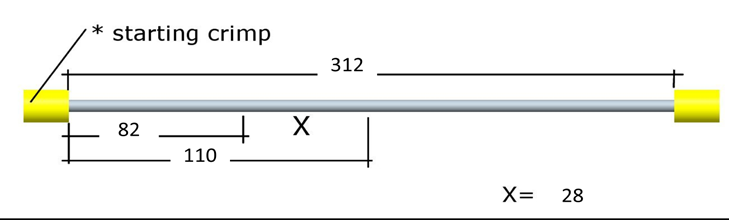

# NECK V2

|      
 Neck V1 - First 2 DOFs 
      |      
 Neck V2 - First 2 DOFs 
      |
| :-------------------------------------------------: | :-------------------------------------------------: |
|  |  |

The second release of the head has 2 tendons and a differential joint to actuate the first 2 DoFs of the neck compared to the 2 serial joints from the one of the previous version V1 make it more robust, powerful and reliable.
[<i class="fa fa-flag fa-1x"></i> **ITA**](Italiano.md#position009a)

## 1.1       Mechanical assembly of the 2 tendons:

!!! note "Fast Forward"
    If you already have a spare tendon from your maintenance kit please jump to 1.2

Prepare 2 cables with the components and specifics described below: 

| IITCODE | Alias            | Descption                                                    |
| ------- | ---------------- | ------------------------------------------------------------ |
| 1001    | U0778110         | Stainless steel microcable, cable construction 7x7mm - (Coated ext 1.0 mm / core 0.81 mm) - CARL STAHL GMBH |
| 2714    | RC_IIT_010_P_064 | D ext/int = 2.4 mm/0.85 mm - length 3.5 mm -- material X5CrNiMo1712-AIS1316 |

**Head CABLE “A”**: IITCODE: 5965 -- Alias: RC_IIT_019_G_018.

                                                                                           

 

**Head CABLE “B”**: IITCODE: 5964 -- Alias : RC_IIT_019_G_017.

                  

Note that the “X” marks in the picture above is the area to be peeled off from the Teflon coating.

 **All dimensions are in mm**.

 

## 1.2       Mounting Procedure

### 1.2.1      Block version identification
| Where yields the difference  | Cable Block V1 | Cable Block V2 |
|: --------: | :--------------: | :-----------------------------: |
|  | |  |
| **Tightening System**   | 2 nut screws M2.5x2.5 + Plate  | 2 screws M2x3            |

### 1.2.2      Rules of Thumb (RoT) for a Perfect START:[<i class="fa fa-flag fa-1x"></i> **ITA**](Italiano.md#position009b)
**Blocking**

>Always block the cable in its portion on which we peeled off the coating.

**Positioning**

>The longest cable portion should be facing toward the front of the robot and vice-versa the shortest part of the cable should be pointing toward the rear of the robot.

**Releasing**
>Make sure that all tensioners are fully opened

!!! Tip
    To block the cable with Cable Block V1 do the following:

    1- Insert the little plate by the front of the neck and push it with any little tool in order to put it in the middle of the throat
    
    2- Make sure the nut screws are already placed in their hole for one turn in their thread.
    
    3- Use a magnet to lift it up in the excavation in the middle of the throat. (see picture below).In this way the throat is free to receive the cable.
    
    4- Insert the cable and use the 2 nut screws (M2.5x2.5) to press the metallic plate above the cable.
    
    5- Check that the cable firmly remains in position even if pulling the cable out.

### 1.2.3        Route Cable ”A”

 

> Start with the longest part of the cable which rolls around the main pulley and turn around the pulley (2) to finally rolls around pulley (3). Use pulley **Y** to both tense and give more slack to the cable to put the crimp the head of the crimp into the lower tensioner. once tense on side of the cable simply turn around pulley (1) the other side of the cable for a ¾ turn and finally insert the crimp onto the lower tensioner of the pulley (4). 
[<i class="fa fa-flag fa-1x"></i> **ITA**](Italiano.md#position010)

<!--

Iniziare dalla parte del cavo più lungo,   fargli fare un ¾ di giro attorno alla puleggia (1) e poi girare attorno alla   puleggia (2) per poi finire sulla puleggia (3) fino ad agganciare il crimp   all’interno del tensionner. Usare la puleggia **Y** per poter recuperare più cavo   per continuare l’altro lato del cavo.   L’altra parte del cavo e’ tutto   sommato facile da posizionare, semplicemente fare ¾ giro della pullegia (1)   e agganciare il crimp dentro il tensionner della puleggia (4).
-->

### 1.2.4        Route Cable “B”

 > Follow the diagram   above to rewire cable B in the same way as cable A but using the pulley **X**.
[<i class="fa fa-flag fa-1x"></i> **ITA**](Italiano.md#position011) 

 <!-- Eseguire   nello stesso modo le instruzioni del cavo “A” ma rispettando I disegni qui sopra, puleggia X-->

### 1.2.5        Final Tensioning

                                  
> Adjust the tension of both cables with the 4 tensioners. 1 and 2 for **Cable A**,    3 and 4 for **Cable B**
[<i class="fa fa-flag fa-1x"></i> **ITA**](Italiano.md#position012)

<!-- Per finire bisogna soltanto tirare i 4 tensionatori.   1   e 2 per **Cable A** , 3 e 4 per **Cable B** -->

## Revision History

| Version | Date        | Author                    | Comments        |
| ------- | ----------- | --------------------------|-----------------|
| 0.1     | 24 Jan 2017 | A. Spadoni                | First emission  |
| 0.2	  | 8 Mar 2017	| A. Spadoni, A Parmiggiani |Document revision|
| 0.3     | 20 July 2017| J. Jenvrin                |For emission     |
| 0.4     |	20 Feb 2019 | J. Jenvrin         |Modification cabling N14|
| 0.5       | Sept 2019 | M. Borgagni                     | word to md|
| 0.6    | Oct. 2019 | J. Jenvrin |add the 2 versions of block cables |

