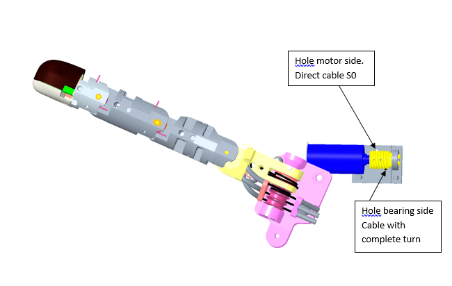
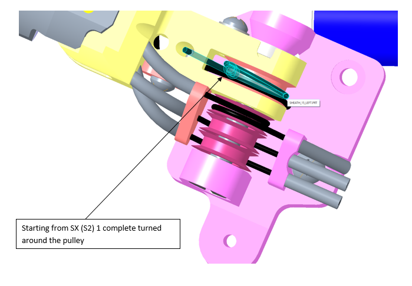
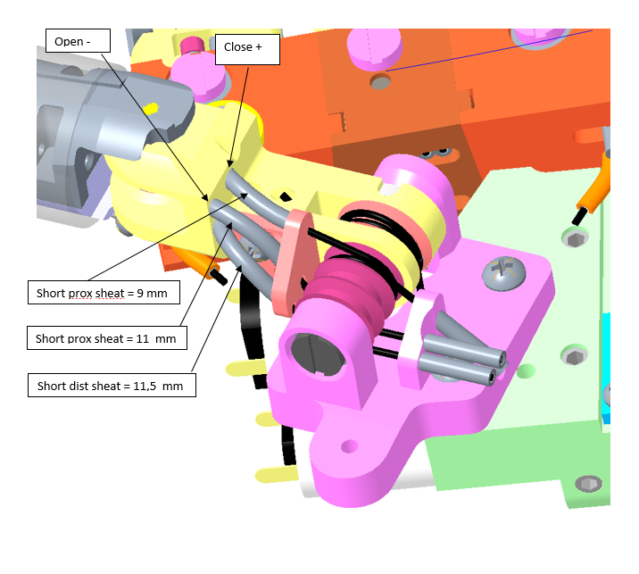

##**1.	LEFT/RIGHT Wrist**

### **1.1 TENDONS LEFT/RIGHT**

|Tendon   |IITCODE   |Length   |Alias   |
|---|---|---|---|
| 1 | 6400 | 72 mm | RC_IIT_019_G_019 |
| 2 | 6402 | 84 mm | RC_IIT_019_G_020 |
| 3 | 6404 | 101 mm | RC_IIT_019_G_021 |
| 4 | 6413 | 124 mm | RC_IIT_019_G_022 |
| 5 | 6414 | 107 mm | RC_IIT_019_G_023 |
| 6 | 6415 | 113 mm | RC_IIT_019_G_024 |
| 7 | 6416 | 112 mm | RC_IIT_019_G_025 |
| 8 | 6417 | 107mm | RC_IIT_019_G_026 |
| 9 | 6418 | 53mm | RC_IIT_019_G_027 |
| 10 | 6419 | 45 mm | RC_IIT_019_G_028 |

!!! Note
    Tendon 9 is the “long tendon”
    
    Tendon 10 is the “short tendon”

Each Tendon is made by a CARL STHAL code  CG077081 (Alias RC_IIT_019_P_0xx - where xx from 19 to 28). Material -  Stainless steel microcable, cable construction 7x7mm, nom. dia 0,81mm, not coated, AISI 304) with the L reported and with two thimbles  (IITCODE 4722 and alias RC_TLR_010_P_100)

### **1.2. SHEAT Versions**

|IITCODE|	Alias|	DescrIption|
|--|--|--|
|2375	|SHEAT|	Open spiral spring, inox steel AISI302, D ext= 1.6mm, D wire= 0.25mm, L = 500 mm
|4545 |4545|	Flat Wire Coil OD1.6mm +/-0.03mm - ID 1.07mm - L = 300 mm|
|13724	|MAZZONI_0_3-0_8_-250_SS_SHEATH|Rectangular section sheath 0.3x0.8, L = 250 mm|

!!!note
    IIT code  13724 is alternative to the 4545 and it was introduced only for cost efficiency 

###**1.3.Tensioner LEFT/RIGHT**

IITcode 3514 - alias RC_TLR_010_G014 - 15mm length - made by

|IIT Code |Alias |Description |Quantity|
|--|--|--|--|
|3559 rev A3|          	RC_TLR_010_P_050|         	TENSIONER BODY|	1|
|3560 rev A1|          	RC_TLR_010_P_046|         	TENSIONER SCREW|             	1|
|3561|	RC_TLR_010_P_049|           	LOCK NUT|                          	1|
|3562 rev A1|          	RC_TLR_010_P_048|         	TENSIONER SCREW|             	1|
|3563	|RC_TLR_010_P_047|          	LOCK NUT|                          	1|

### **1.4 Right Forearm/Wrist tendons** 

 

### **1.5 Left Forearm/Wrist tendons**

##**2.Finger sheats**

|Finger   |Prox/Dist   |Label   |Lenght   |IITCODE   |
|---|---|---|---|---|
|Thumb   |Proximal   |(6+S) (6+L)   |185 + 9      mm   |13724   |
|Thumb   | Proximal  |(6-S)  (6-L)   |185 + 11 mm   |13724   |
|Thumb	|Distal|	N°4|	  57 + 11.5 mm	|2375   |
|Index|	Proximal|	(8+S)  (8+L)	|224 mm	|13724   |
|Index|	Proximal|	(8-S)   (8-L)|	224 mm|	13724   |
|Index|	Distal|	N°5|	105 mm|	2375   |
|Middle|	Proximal|	(7+S)  (7+L)|	224 mm|	13724   |
|Middle|	Proximal|	(7-S)   (7-L)|	224 mm|	13724   |
|Middle|Distal	|N°3	|105 mm	|2375   |
|Ring Finger|	|	N°2|	95   mm|	2375   |
|Little Finger|	|	N°9|	95   mm|	2375   |

​				
​			   	

​				

## **3. Left Hand**

     Opposite palm view 

###**3.1 Left THUMB**

Left Thumb Abduction cable diam 0,63 mm

###**3.2  Thumb Metacarpus sheath positions**

From S2 make 1 turn around the pulley (see follow drawing) 

From S0 go directly to the hole (see follow drawing)

!!! Note
    Proximal thumb sheaths are made from IIT-13724 - MAZZONI_0_3-  0_8_-250_SS_SHEATH rectangular 0,3x0,8 mm, L= 250 mm
    

    Distal thumb sheaths are made from IIT-2375 – SHEATH - Open spiral spring, inox steel AISI302, D ext= 1.6mm, D wire= 0.25mm – L = 500 mm

