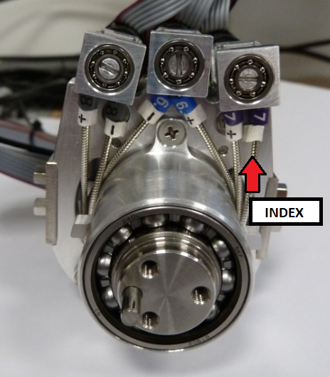

!!! NOTE "SUM UP"
    Updating the forearm in V2 had had for consequences the following changes compared to the wiring of the V1 - Please refer to this manual to compel with the new attributes.

# 1	WRIST

## 1.1  Right Forearm/Wrist tendons

 

## 1.2  Left Forearm/Wrist tendons

## 1.3  TENDONS LENGTH

|Tendon   |IITCODE   |Length   |Alias   |
|---|---|---|---|
| 1 | 6400 | 72 mm | RC_IIT_019_G_019 |
| 2 | 6402 | 84 mm | RC_IIT_019_G_020 |
| 3 | 6404 | 101 mm | RC_IIT_019_G_021 |
| 4 | 6413 | 124 mm | RC_IIT_019_G_022 |
| 5 | 6414 | 107 mm | RC_IIT_019_G_023 |
| 6 | 6415 | 113 mm | RC_IIT_019_G_024 |
| 7 | 6416 | 112 mm | RC_IIT_019_G_025 |
| 8 | 6417 | 107mm | RC_IIT_019_G_026 |
| 9 | 6418 | 51 mm | RC_IIT_019_G_027 |
| 10 | 6419 | 43 mm | RC_IIT_019_G_028 |

!!! Note
    Tendon 9 is the “long tendon” and Tendon 10 is the “short tendon”, they are not represented here but they are located at the base of the wrist.

## 1.4  Construction table

Here is the table reported the list of part needed to build them.

| Number of pieces | IITCODE | Alias/Provider Code | Description                                                  |
| ---------------- | ------- | ------------------- | ------------------------------------------------------------ |
| 1                | 4482    | CG077081            | Stainless steel microcable, cable construction 7x7mm, nom. dia 0,81mm, not coated, AISI 304 |
| 2                | 4722    | RC_TLR_010_P_100    | THIMBLE FOR CABLE 0.8mm                                      |

Each Tendon is made by CARLSTAHL, GmBH from code  CG077081 (Alias RC_IIT_019_P_0xx - where xx from 19 to 28). with the L reported from the the length table (see above) and with two thimbles.

## 1.5  Tensioner - IITCODE 3514

The tensioner IITCODE 3514 is an assembly - alias RC_TLR_010_G014 - made with the following pieces:

|IIT Code |Alias |Description |Quantity|
|--|--|--|--|
|3559 rev A3|          	RC_TLR_010_P_050|         	TENSIONER BODY|	1|
|3560 rev A1|          	RC_TLR_010_P_046|         	TENSIONER SCREW|             	1|
|3561|	RC_TLR_010_P_049|           	LOCK NUT|                          	1|
|3562 rev A1|          	RC_TLR_010_P_048|         	TENSIONER SCREW|             	1|
|3563	|RC_TLR_010_P_047|          	LOCK NUT|                          	1|

# 2.	Finger sheaths

|Finger   |Prox/Dist   |Label   |Length (mm)   |IITCODE - sheath to use   |
|---|---|---|---|---|
|Thumb   |Proximal   | 6+   |185   |13963   |
|Thumb|Short Prox|     |9|2375|
|Thumb   | Proximal  |6-   |185|13963   |
|Thumb|Short Prox | |11| 2375|
|Thumb	|Distal| N4 |	  57	|2375   |
|Thumb |Short Dist|  |11.5|2375|
|Index|	Proximal|	8+	|224	|13963   |
|Index|	Proximal|	8-| 224 |	13963   |
|Index|	Distal| N5 | 105 |	2375   |
|Middle|	Proximal|	7+| 224 |	13963   |
|Middle|	Proximal|	7-| 224 |	13963   |
|Middle|Distal	|N3	|105	|2375   |
|Ring Finger|	| N2 | 95 |	2375   |
|Pinkie|	| N9 | 95 |	2375   |
|Finger abduct| | T0| 90 (1) |2375|
|Finger abduct| | T2| 27 |2375|
|Finger abduct| | T4| 44 |2375|
|Thumb| oppose | S0 | 50 |13963|
|Thumb| oppose | S2 | 57 |13963|

!!! NOTE
    (1) the length 90 mm of T0 comes from previous version where there was: T0+T3+tensioner (38+38+14 mm)

!!! WARNING
    Please respect the labelling - remove the excess of color ring letter or number, **!!!they are not anymore in use!!!!**			   	

## 2.1  SHEAT Versions

|IITCODE|	Alias|	Description|
|--|--|--|
|2375	|SHEAT|	Open spiral spring, inox steel AISI302, D ext= 1.6mm, D wire= 0.25mm, L = 500 mm
|4545 |4545|	Flat Wire Coil OD1.6mm +/-0.03mm - ID 1.07mm - L = 300 mm|
|13963	|MAZZONI_0_3-0_8_-250_SS_SHEATH|Rectangular section sheath 0.3x0.8, L = 250 mm|

!!!NOTE
    IIT code  13963 is alternative to the 4545 and it was introduced only for cost efficiency

!!!DANGER
    inside sheath 13724 please **DO NOT USE** teflon sheath!!!

# 3	Hand Wiring

!!! NOTE "SUM UP"
    You will find below a certain amount of pictures illustrating the changes or helping you to individuate the cabling and labelling of the different sheaths located in the hand part of the Forearm

## 3.1  Palm

     Left palm, view from top - S0 and S2 cable from the thumb oppose

!!!NOTE
    The Right Thumb oppose sheath are the exact same just mirrored so the rule of the longest (S2) and the shortest (S0) is still the same.

## 2.1 Left THUMB

Here, you will find some rues to individuate the wiring and sheath for the wiring of the thumb oppose, the thumb proximal and distal.

## 3.2  Thumb Metacarpus sheath positions

!!! WARNING "REMINDER"

    The following list of sheaths are made from IITCODE :2375 - Open spiral spring, inox steel AISI302, D ext= 1.6mm, D wire= 0.25mm – L = 500 mm:
    
    	- Distal Thumb
    	- Short Distal Thumb
    	- Short Prox Thumb

# 4 	Proximal Sheath - Position of the motor and labelling, cable routing

## 4.1  Position of the motors and labelling

### Left Forearm

### Right Forearm

!!!WARNING
    Please note that the proximal of the Left and Right Arm are symmetrical respect to the median plan of the body, meaning that index prox (7) is on the left side of the right forearm and on the right side of the left forearm.

## 4.2  Cable routing

Here an example of good routing for the left forearm. Useless to say that the Right needs to look like identical.

