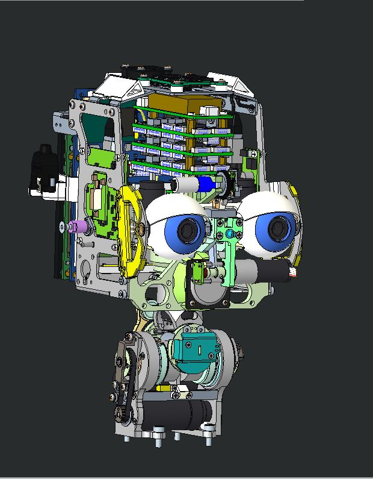
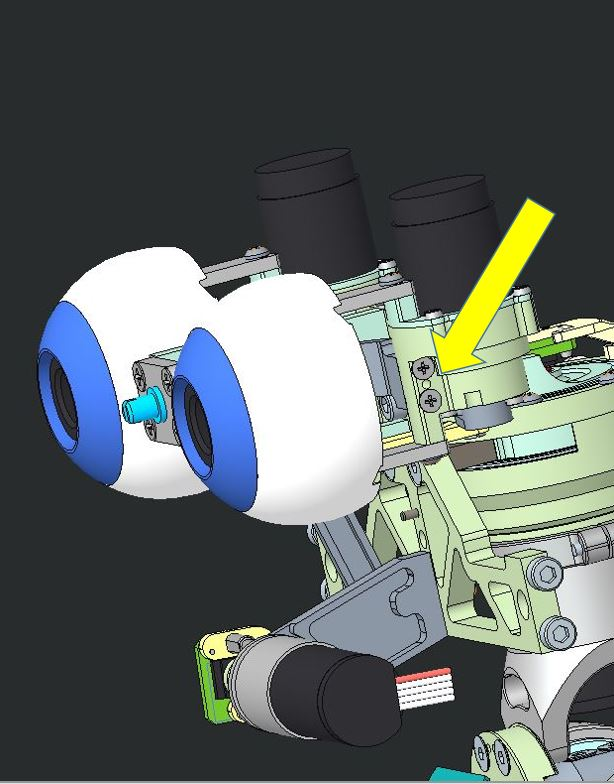

# **Eyes motor support replacement**

## Content material

|  Pieces |     Alias           |          Description                        |  Cod. Wgst |
|   :---: |    :---:            |     :---:                                   |   :---:   |
|    2   | RC_IIT_010_P_038 | EYE_ACTUATING-JOINT_BASE | 2617 |
|     1   | RC_IIT_010_P_047 | V2 eye tilt brace A | 2626 |
|     1   |  RC_IIT_010_P_048  | V2 eye tilt brace B | 2627 |
|    2   |  2-10--_-_ISO7046-1_CH  | Screw -M 2 x 10  –  ISO7046 – SS A2 | 2596 |
|     4   | S1_5-6--_-_I2338_B | Dowel pin 1.5 x 6 stainless steel A2, UNI1707 |   2354    |

## Assembly instruction

We are going to replace parts in the eyes tilt assembly, there are some preliminary actions to take:

* we need to turn off the head and the whole robot.

* we need to remove head's covers .

* we need to unplug and remove the whole boards' frame.

    | 
  
 | 
  
 |
    | :--------------------------------------------------: | :--------------------------------------------------: |
    |                    without covers                    |                without boards' frame                 |

  

    We are going to replace the 4 parts here in picture.
    
  
 
    
    We need to remove eye's assembly from the head unlocking two cross recessed screws

  | 
  
 | 
  
 |
    | :--------------------------------------------------: | :--------------------------------------------------: |
    |                    the screws to remove                   |                eye's group                 |

There are two of these parts  in iCub's neck. Here is a picture of the neck with the parts in red.

|  |
| :-----------------------------------------------------------: |
|  The neck with the pulleys in red |

Here are the instructions for replacing the left pulley.

- First of all you need to remove tendons from the neck, 
- Remove the green highlighted assembly loosening the screws indicated by arrows

    | 
  
 |
    | :-----------------------------------------------------------: |
    |  tbd |

- Untight the screw shown in left picture to extract the whole motor assembly shown on the right.

    | 
  
 |  
  
 |
    | :----: | :----: |
    | The whole neck | The motor assembly |

- Gently remove pulley's assembly as on left picture and remove the flex spline from the pulley untightening the screw shown on rigth.

    | 
  
 |  
  
 |
    | :----: | :----: |
    | pulley assembly |  the screw to remove    |

- Repeat the procedure above to extract  the rigth pulley.
- When the two old pulleys are removed,  mount back the new ones by following instructions in reverse.
