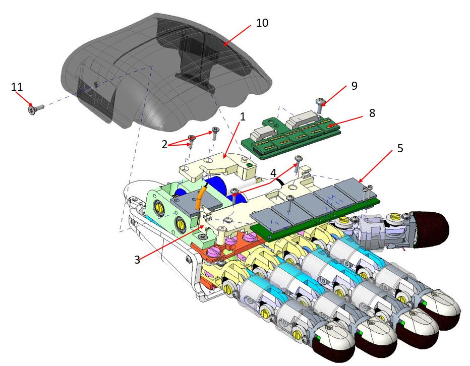

# **Update Support for Right and Left hand for iCub**

## Content material

|  Pieces |     Alias           | Position | Rev |          Description                              |  Cod. Wgst |
|   :---: |    :---:            |  :---:   |:---:|             :---:                                 |   :---:   |
|     1   |  RC_IIT_011_P_063   |          |     |      Left support for Mais                        | 14357 |
|     1   | RC_IIT_011_G_017    |          |     |      Left support for FTC                         | 14354 | 
|     1   |  RC_IIT_011_P_062   |     3    |     |     Right support for Mais                        | 14356 |
|     1   |  RC_IIT_011_G_016   |     1    |     |     Right support for FTC                         | 14355 |
|     4   |  ISO 7046 M1.6x5    |     2    |     |     screws for right/left support FTC             | 11229 |
|     6   | ISO 7045 M1.6x6     |  4 / 6   |     |     screws for right/left support Mais            |  2399 |
|     4   | ISO 1207 M1x5       |     7    |     |     screws for right/left support and Mais board  |  2406 |
|     2   | RC_IIT_017_P_031    |    10    |     |     UPPERCOVER HAND RIGHT                         |  5448 |   
|     2   | RC_IIT_017_P_030    |          |     |     UPPERCOVER HAND LEFT                          |  5447 |      
|     2   |  V2-6--_-_ISO7046-1_CH |   9   |     |    Screw for uppercover Hand                      |  2440 |

## Assembly instruction

First of all you need to know that you will be in a situation where you will have to disassemble the components to replace and disconnect the Corn and FTC boards  in order to move them and leave the workspace free as much as possible.
Once this is done the first piece to be mounted will be the rc_IIT_011_g_016 or the rc_IIT_011_g_017 (right or left hand) as shown in the video. All this because you will find yourself in the condition in which you will have to pass the piece between the cables (tendons) that move the thumb.
**This explanation is the same for both hands**

  

##Exploding: 
Reference Right hand

    

    

Assemble upgrade support Mais and FTC 

  

  

##Assembly sequence##

    

Mounting the cover (back of the hand):
pass the hook of the dorsum cover between the steel cable (tendon) and the palm of the hand (cover).
See video

<video style="display: block;margin-left: auto;margin-right: auto;width:70%; border:solid 1px" controls autoplay muted>
    <source src="../movie/video.mp4">
</video>
